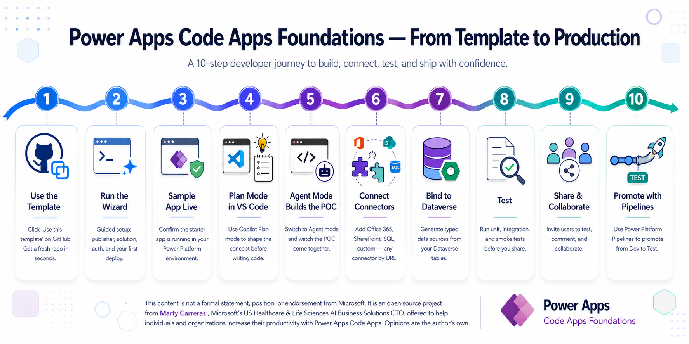

# Power Apps Code Apps — Foundations

A GitHub template with everything your coding agent needs to build Power Apps Code Apps. Clone it, open your IDE, and start talking to your agent.

[](LICENSE)



## Get Started — Six Steps

| | Step | What you do |
|---|---|---|
| **1** | **Clone from the template** | On GitHub, click **Use this template → Create a new repository**. You now own a complete, batteries-included repo of your own. |
| **2** | **Open it in your IDE** | Paste the repo URL into your IDE's *Clone repository* prompt — VS Code, Cursor, or any editor with coding-agent support. |
| **3** | **Ask your agent to handle prerequisites** | Open the chat and say: *"Check for and address all prerequisites for this repo."* Node, .NET, PAC CLI, Python, npm packages, sign-ins — the agent walks you through every gap. |
| **4** | **Ask your agent to run the Wizard UX** | Just type: *"Run the wizard UX."* A guided browser experience launches at `localhost` and walks you through publisher, environment, App Registration, auth, and scaffold. |
| **5** | **Follow the wizard to a live sample app** | Ten guided steps, all visual. At the end, your sample Code App is registered, deployed, and showing up in **make.powerapps.com** ready to play. |
| **6** | **Switch to Plan mode and start building** | Open Agent **Plan mode** in your IDE and describe what you want to build. The agent reads `AGENTS.md` and the instruction files, plans the work, and gets to it. |

> **That's it.** Everything after this is reference material. Your coding agent reads the instruction files for you — you don't need to read them yourself.

---

## What You'll Need

- An **editor** with a coding agent — VS Code + GitHub Copilot (recommended), Cursor, Claude Code, or Codex
- A **Power Platform environment** with Dataverse enabled — get one free via the [Power Apps Developer Plan](https://learn.microsoft.com/en-us/power-platform/developer/plan) or the [Microsoft 365 Developer Program](https://developer.microsoft.com/microsoft-365/dev-program)
- **Node.js 20+**, **Git**, **.NET SDK 8+** — your agent can install these for you in Step 3

> **Windows, macOS, and Linux** all work. On Windows, clone outside OneDrive-synced folders to avoid path-length issues.

---

## Methodology — Plan First, Prototype Second, Connect Later

Foundations encodes a deliberate sequence for non-trivial apps:

1. **Describe your app** in plain English — the agent decomposes the business problem
2. **Prototype the UX** against mock data — validate with stakeholders before freezing schema
3. **Provision Dataverse schema** — the [Dataverse-skills plugin](https://github.com/microsoft/Dataverse-skills) handles tables, columns, and relationships
4. **Bind real connectors** — `pac code add-data-source` generates your TypeScript SDK
5. **Build, test, deploy** — `pac code push` to dev, promote through Power Platform Pipelines

The wizard doesn't ask for connection IDs on the first run. That comes later, when your prototype is stable.

---

## Dataverse-skills Plugin

Foundations delegates Dataverse environment operations to the [microsoft/Dataverse-skills](https://github.com/microsoft/Dataverse-skills) plugin — schema provisioning, data seeding, solution lifecycle, and admin tasks are handled by the plugin's battle-tested, MCP-native skills. Foundations owns the planning workflow, Code App scaffold, connector adapters, and form field patterns.

The wizard (Step 10) detects your coding agent and shows the correct install command. Or install manually:

- **GitHub Copilot:** `/plugin install dataverse@awesome-copilot`
- **Claude Code:** `/plugin install dataverse@claude-plugins-official`

Prerequisites: Python 3 + `pip install PowerPlatform-Dataverse-Client pandas`

---

## Staying Updated

Projects created from this template can pull improvements without affecting project-specific code:

```bash
npm run sync:foundations
```

Syncs instruction files, wizard, scripts, and docs. Never touches `src/`, `package.json`, or your solution artifacts.

---

## Learn More

| Resource | Description |
|----------|-------------|
| [Visual Guide](docs/guide.html) | Interactive walkthrough with step breakdowns and portal links |
| [Landing Page](docs/index.html) | High-level overview of the methodology and tech stack |
| [Prototype Golden Path](docs/prototype-golden-path.md) | Full delivery sequence from planning to real providers |
| [Agent Support](docs/agent-support.md) | Which files each coding agent reads and how to verify |
| [Glossary](docs/glossary.md) | Power Platform terminology reference |
| [Troubleshooting](TROUBLESHOOTING.md) | Common issues with PAC CLI, auth, connections, and deployment |

---

<details>
<summary><strong>For coding agents — How this repo works</strong></summary>

### Agent entry points

| Agent | Root Entry Point | Scoped Rules |
|-------|-----------------|---------------|
| **GitHub Copilot** | `AGENTS.md` | `.github/instructions/*.instructions.md` (canonical source) |
| **Claude Code** | `CLAUDE.md` → imports `AGENTS.md` | `.claude/rules/*.md` |
| **Cursor** | `AGENTS.md` | `.cursor/rules/*.mdc` |
| **Codex** | `AGENTS.md` | Nested `AGENTS.md` in subdirectories |

The `.github/instructions/` files are the canonical source. Claude, Cursor, and Codex projections are generated from them via `npm run guidance:generate`. See [docs/agent-support.md](docs/agent-support.md) for details.

### Dataverse-skills plugin scope split

| Responsibility | Owner |
|---|---|
| Schema provisioning (tables, columns, relationships, option sets) | **Dataverse-skills plugin** (`dv-metadata`) |
| Data operations (CRUD, bulk import, sample data) | **Dataverse-skills plugin** (`dv-data`, `dv-query`) |
| Solution lifecycle (export, import, deploy) | **Dataverse-skills plugin** (`dv-solution`) |
| Environment admin (bulk delete, settings, security roles) | **Dataverse-skills plugin** (`dv-admin`, `dv-security`) |
| Business planning workflow (00a → 00b → 00c → 00d) | **This repo** |
| Planning artifact validation & generation | **This repo** |
| Code App scaffold, connector adapters, form field pattern | **This repo** |
| `pac code add-data-source` registration & TypeScript SDK generation | **This repo** |
| Deployment settings & CI/CD | **This repo** |

### What's inside

```
PAppsCAFoundations/
├── .github/instructions/       # Canonical coding-agent instructions (14 files)
├── .claude/rules/              # Claude Code projections (auto-generated)
├── .cursor/rules/              # Cursor projections (auto-generated)
├── docs/                       # Visual guide, landing page, glossary, golden path
├── scripts/                    # Dataverse helpers, auth, sync, agent detection
├── wizard/                     # Terminal wizard (10 steps)
├── wizard-ux/                  # Browser wizard (Fluent UI v9)
├── AGENTS.md                   # Root agent directive
├── CLAUDE.md                   # Claude Code entry point
└── README.md                   # You are here
```

### Dataverse helper flow

```bash
node scripts/validate-schema-plan.mjs dataverse/planning-payload.json
node scripts/generate-dataverse-plan.mjs dataverse/planning-payload.json
# → Agent uses dv-metadata to provision schema
node scripts/register-dataverse-data-sources.mjs dataverse/register-datasources.plan.json
```

</details>

<details>
<summary><strong>Licensing — Power Apps Code Apps</strong></summary>

Code Apps are a **premium Power Apps feature**. Publishing (`pac code push`) requires one of:

- **Power Apps Premium** per-user license, OR
- **Power Apps Developer Plan** (free, individual use only), OR
- **Microsoft 365 Developer Program** sandbox tenant (free, renewable)

If you're trying this for the first time, the [M365 Developer Program](https://developer.microsoft.com/microsoft-365/dev-program) gives you a sandbox tenant with Dataverse and App Registration permissions — which your corporate tenant may not allow.

</details>

## Contributing

See [CONTRIBUTING.md](CONTRIBUTING.md) for guidelines.

## License

[MIT](LICENSE)

---

> **Disclaimer:** This content is **not a formal statement, position, or endorsement from Microsoft**. It is an open source project from [Marty Carreras](https://www.linkedin.com/in/martycarreras/), Microsoft's US Healthcare & Life Sciences AI Business Solutions CTO, offered to help individuals and organizations increase their productivity with Power Apps Code Apps. Opinions are the author's own.
